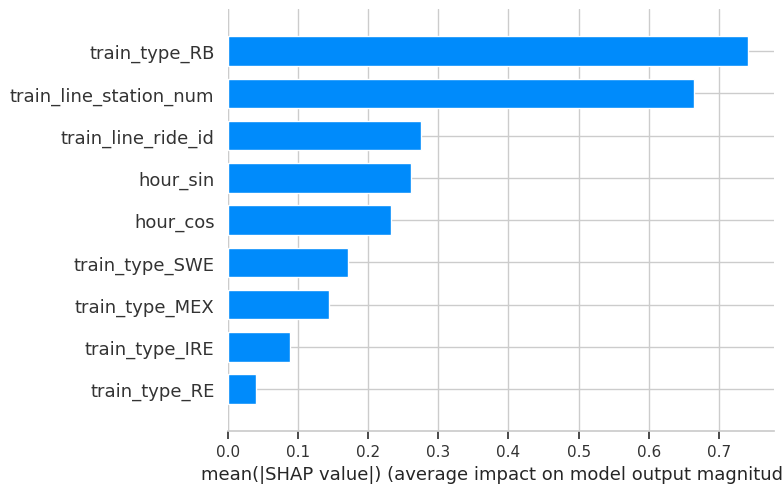

# Railway Delay Prediction and Explainability: A Comparative Study in Tübingen (Germany)
*Advanced machine learning and SHAP interpretability to improve delay prediction and reliability insights in Germany’s national railway system (Deutsche Bahn).*

**Dataset**: 12 months of railway operations (24,760 cleaned records)  
**Techniques**: refined feature engineering, boosting models (XGBoost, LightGBM, CatBoost), SHAP explainability  
**Key Result**: Random Forest reached 0.87 accuracy with 0.35 recall for critical delays and achieved R² = 0.25 in delay prediction; CatBoost achieved the lowest MAE (2.30 min) for delay duration

---

## Project Series

This project is part of a two-stage analysis of railway delays at **Tübingen Hauptbahnhof**.

1. **Railway Delay Analysis - Tübingen (Germany)**  
Exploratory analysis and statistical investigation of operational delay patterns.

2. **Railway Delay Modeling & Explainability - Tübingen (Germany)** *(this project)*  
Application of advanced machine learning models and explainability techniques to understand the structural drivers of railway delays.

---

## Business Context

Reliable public transportation plays an important role in daily mobility in Germany, especially for commuters and students who depend on rail services.

In the previous project, exploratory analysis of railway operations at **Tübingen Hauptbahnhof** revealed recurring delay patterns, including weekday fragility, service-type differences and peak-hour effects.

However, predicting the **exact duration of delays** proved difficult due to the complex and often unpredictable nature of railway systems.

This second project therefore focuses on **predictive modeling and explainability**, evaluating whether advanced machine learning techniques can improve predictions and provide deeper insight into the operational factors behind delays.

---

## Dataset

Source: Deutsche Bahn Railway Data  
https://huggingface.co/datasets/piebro/deutsche-bahn-data

The original dataset contains **millions of train operation records across Germany**.

For this project, a Python streaming approach was used to extract only the records related to **Tübingen Hbf** over a **12-month period (Aug 2024 – Jul 2025)**.

---
## Problem Statement

Can advanced machine learning models improve delay prediction and critical delay detection for Tübingen Hbf, and what do explainability methods reveal about the structural drivers behind delays?

---

## Objectives

- Reuse engineered features and operational insights from the previous project
- Benchmark performance with Random Forest (baseline)
- Evaluate gradient boosting models (XGBoost, LightGBM, CatBoost)
- Compare results across **regression** (delay minutes) and **classification** (critical delays)
- Apply **SHAP** to interpret model decisions and identify the strongest drivers
- Translate results into operational insights that support planning and monitoring

---

## Methodology

1. **Data Cleaning and Consistency**:  Same cleaning rules as the previous project (timestamp conversion, removing negative delays, preserving operational realism).

2. **Exploratory Insights Recap**: Short recap of the structural patterns already validated in the first study (without repeating the full EDA).

3. **Modeling Dataset Preparation**: Remove identifiers and post-event timing fields to avoid leakage; prepare a modeling-ready dataset.

5. **Feature Engineering**:
   - One-hot encoding for service categories (train type)  
   - **Cyclical time encoding** using sine/cosine transformations for hour-of-day  
   - Binary target creation for critical delays (> 5 minutes)

6. **Model Selection and Validation**:  
   - Baseline: Random Forest (regression and classification)  
   - Boosting: XGBoost, LightGBM, CatBoost  
   - Evaluation with error metrics (MAE/RMSE) and classification metrics (precision/recall/F1)

7. **Model Interpretation (SHAP)**: Use SHAP values to explain feature impact globally and on individual predictions.

---

## Tools & Technologies

- Python (Pandas, NumPy)
- Scikit-learn
- XGBoost, LightGBM, CatBoost
- SHAP (Model Explainability)
- Matplotlib, Seaborn
- Data Source: Deutsche Bahn data (public repository) and curated dataset from the previous project

---

## Exploratory Data Analysis Highlights

This project does not repeat the full EDA from the previous study, but key structural behaviors remain important for modeling:

- **Extreme events are rare but important:** the distribution is strongly right-skewed (max delay 331 minutes).
- **Service-type behavior differs:** express and regional services show distinct delay dynamics.
- **Early-week fragility persists:** Mondays show higher average delays than other weekdays.
- **Rush hour amplifies impact:** peak periods increase mean delays (3.83 vs. 2.77 minutes).

These patterns shape both model framing and interpretation.
 
  

*Average delay by weekday. Mondays show consistently higher delays.*

---

## Modeling Approach

This project uses two predictive tasks to reflect real operational needs:

**Regression Task (Predicting Delay Duration)**  
Estimates expected delay minutes under typical conditions. This supports baseline performance monitoring and operational planning.

**Classification Task (Predicting Critical Delay Risk)**  
Labels delays above 5 minutes as critical delays to better align modeling with passenger decision-making and disruption risk.

A key design choice in this project is **cyclical time representation** (hour_sin/hour_cos), which helps models treat late-night and early-morning hours as adjacent rather than distant. This refined feature representation plays a key role in improving the model’s ability to capture delay variability compared to the previous approach.

---

## Model Performance

### **Random Forest (Baseline)**

Two predictive tasks were evaluated.

#### Regression (predicting delay duration in minutes)
- MAE: **2.42 minutes** 
- RMSE: **5.41 minutes**

The  results indicate that routine delay durations can be estimated with relatively low average error, suggesting that common operational patterns are captured by the model.

#### Classification (predicting critical delays > 5 minutes)  
- Accuracy: **0.87**  
- Precision: **0.67**  
- Recall: **0.35**  

While overall accuracy is high (0.87), recall remains limited (0.35), meaning that many severe disruptions are still difficult to detect. This likely reflects irregular events that are not represented in the dataset.


### **Gradient Boosting Models**
To evaluate whether more advanced models could improve predictions, three boosting algorithms were tested: **XGBoost, LightGBM and CatBoost**.

#### **Regression performance (MAE)**

- XGBoost MAE: **2.42 minutes**  
- LightGBM MAE: **2.48 minutes**  
- CatBoost MAE: **2.30 minutes**

Among the models tested, **CatBoost achieved the lowest MAE**, indicating slightly better performance in estimating delay duration.

#### **Classification performance (accuracy / recall for critical delays)**

- XGBoost: Accuracy **0.86**, Recall **0.31**  
- LightGBM: Accuracy **0.87**, Recall **0.35**  
- CatBoost: Accuracy **0.86**, Recall **0.31**

Overall, classification performance remained similar to the baseline model. Recall for critical delays stayed between **0.31–0.35**, suggesting that rare disruption events remain difficult to predict with the available features.

---

## Key Insights

- **Model choice had limited impact on critical delay detection:** boosting did not consistently improve recall for critical delays, reinforcing that rare disruptions are difficult to anticipate without external variables.
- **Routine delays are more predictable than extremes:** low MAE shows models perform well on typical patterns, while RMSE reflects sensitivity to rare high-impact events.
- **Cyclical time encoding supports operational realism:** using sine/cosine for hour improves how models represent daily rhythms.
- **Explainability adds practical value:** SHAP reveals which operational variables dominate predictions, making model outputs easier to trust and communicate.

---

## Business Impact & Applications

**Predictive delay monitoring**: Use regression predictions to estimate routine delay minutes and track performance trends over time.

**Route-level risk assessment**: Route structure variables (ride and station sequence) indicate corridor-dependent behavior, helping identify recurring bottlenecks.

**Operational optimization**: Different service categories show different delay contributions, supporting differentiated buffer strategies and schedule planning.

**Decision support and communication**: Explainability improves transparency, making it easier to communicate why certain situations are predicted as higher risk.


  

*Global SHAP summary showing which features drive delay predictions.*  

  

*Global feature importance ranked by SHAP contribution.*

---

## Next Steps

- Integrate external data (weather, maintenance schedules, disruption logs) to improve critical delay recall
- Add uncertainty estimation to better communicate prediction confidence
- Test time-aware validation to reflect operational sequencing
- Build a monitoring dashboard to track reliability by service category and route corridor

---

## Repository Structure

```
.
├── data
├── notebooks
├── images
├── requirements.txt
└── README.md
```

---

## Strategic Perspective

I intentionally kept the dataset constant from the first project to maintain experimental control. This makes comparisons across models more meaningful: improvements (or lack of improvements) reflect modeling choices rather than new variables.

The main takeaway is practical: **advanced algorithms do not automatically solve structural uncertainty**. In operational systems, the biggest gains often come from better context data, not only stronger models. This mindset - balancing performance with realism and interpretability - is central to how I approach analytics and decision support.

---

## Conclusion

This project extends the original Tübingen delay analysis by focusing on advanced modeling and interpretability.

Random Forest provided a strong baseline, and CatBoost achieved the best error performance for routine delay prediction. However, detecting critical delays remained challenging across models, reinforcing that rare disruptions require additional contextual data.

By combining model benchmarking with SHAP explainability, the project delivers both predictive outputs and transparent operational insight that can support planning, monitoring, and communication.
